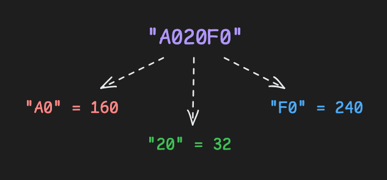

# Functions Practice
Doc2Doc should seamlessly convert [hex](https://en.wikipedia.org/wiki/Hexadecimal) [triplet color codes](https://en.wikipedia.org/wiki/Web_colors#Hex_triplet) to RGB values. Hex colors are an efficient means of representing color with only 6 characters. RGB values combine red, green and blue light to electronically display the entire color spectrum.
<br />
<br />

## Assignment
Debug the `hex_to_rgb` function. `hex_to_rgb` should take a hex triplet color code and return three integers for the RGB values using int().
1. Some of the arguments passed to int() on lines 4, 5, and 6 are incorrect. Review the linked documentation to see how to convert hexadecimal (base 16) values.
2. Use the provided `is_hexadecimal` function inside of `hex_to_rgb` to check if `hex_color` is a valid hexadecimal string.
3. If the input is not six characters long or is not a valid hex string, raise the exception `"not a hex color string"`.

Example:
```
red_val: int
green_val: int
blue_val: int
red_val, green_val, blue_val = hex_to_rgb("A020F0")

print(red_val)
# prints 160

print(green_val)
# prints 32

print(blue_val)
# prints 240
```

