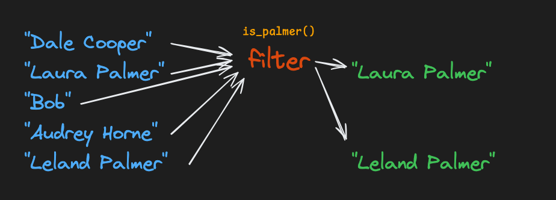

# Filter
The built-in [filter function](https://docs.python.org/3/library/functions.html#filter) takes a function and an iterable (often a list) and returns an iterator that keeps elements from the original iterable only where the result of the function on that item returned `True`.


In Python:
```
def is_even(x: int) -> bool:
    return x % 2 == 0

numbers: list[int] = [1, 2, 3, 4, 5, 6]
evens: list[int] = list(filter(is_even, numbers))
print(evens)
# [2, 4, 6]
```
<br />
<br />

## Assignment
Complete the `remove_invalid_lines` function. It accepts a `document` string as input. It should:
1. Use the built-in `filter` function with a lambda to make a filtered copy of the input `document`.
    1. Remove any lines that start with a `-` character.
    2. Keep all other lines and **preserve any trailing newlines (\n)**.
2. Return the result, all on one expression.

For example, this:
```
* Star Wars episode 1 is underrated
- Star Wars episode 9 is fine
* Star Wars episode 3 is the best
```

Should become:
```
* Star Wars episode 1 is underrated
* Star Wars episode 3 is the best
```
<br />
<br />

## Tips
The following methods may be useful:
[.join](https://docs.python.org/3/library/stdtypes.html#str.join)
```
"\n".join(["a", "b", "c"])
# a
# b
# c
```

[.startswith](https://docs.python.org/3/library/stdtypes.html#str.startswith)
```
s: str = "hello"
s.startswith("h")
# True
s.startswith("o")
# False
```

[.split](https://docs.python.org/3/library/stdtypes.html#str.split)
```
s: str = """hello
world"""
lines: list[str] = s.split("\n")
# ['hello', 'world']
```

If you use `.split("\n")`, the newlines are removed from the resulting strings. However, you can use `"\n".join(...)` to put them back together!