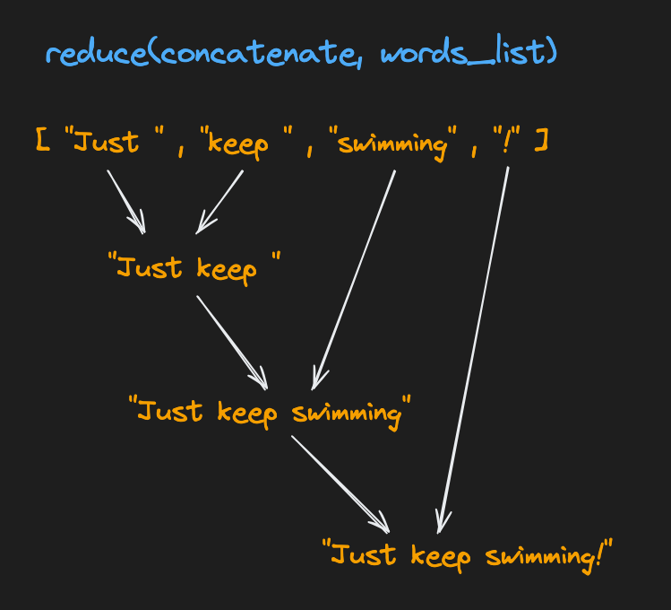

# Reduce
The built-in [functools.reduce()](https://docs.python.org/3/library/functools.html#functools.reduce) function takes a function and a list of values, and applies the function to each value in the list, accumulating a single result as it goes.


```
# import functools from the standard library
import functools

def add(sum_so_far: int, x: int) -> int:
    print(f"sum_so_far: {sum_so_far}, x: {x}")
    return sum_so_far + x

numbers: list[int] = [1, 2, 3, 4]
sum: int = functools.reduce(add, numbers)
# sum_so_far: 1, x: 2
# sum_so_far: 3, x: 3
# sum_so_far: 6, x: 4
# 10 doesn't print, it's just the final result
print(sum)
# 10
```

Notice that we're passing the function `add` without the `()`! It means that `reduce` will take care of execution and pass the parameters for you. Think of passing `add` like handing someone a recipe (the instructions), instead of the finished dish (the result of the execution).
<br />
<br />

## Assignment
Complete the `join` and the `join_first_sentences` functions.
1. Complete the `join` function. It's a helper function we'll use in `join_first_sentences`.
    1. It takes two inputs:
        1. A `doc_so_far` accumulator string – similar to the `sum_so_far` variable in the example above.
        2. A `sentence` string – this is the next string we want to add to the accumulator.
    2. Returns the result of concatenating the "doc" and "sentence" strings together, with a period and a space in between. For example:
    ``` 
    doc: str = "This is the first sentence"
    sentence: str = "This is the second sentence"
    print(join(doc, sentence))
    # This is the first sentence. This is the second sentence
    ```
2. Complete the `join_first_sentences` function.
    1. It accepts two arguments:
        1. A list of sentence strings
        2. An integer `n`
    2. Only use the first `n` sentences from the list. If `n` is zero, just return an empty string.
    3. Use [functools.reduce()](https://docs.python.org/3/library/functools.html#functools.reduce) with your `join` function to combine the sliced sentences into a single string.
    4. Add a final period without a trailing space and return this string.


> Use [list slicing](https://docs.python.org/3/library/stdtypes.html#common-sequence-operations) to get the first `n` sentences.

Here's an example of the expected behavior:
```
joined: str = join_first_sentences(
    ["This is the first sentence", "This is the second sentence", "This is the third sentence"],
    2
)
print(joined)
# This is the first sentence. This is the second sentence.
```