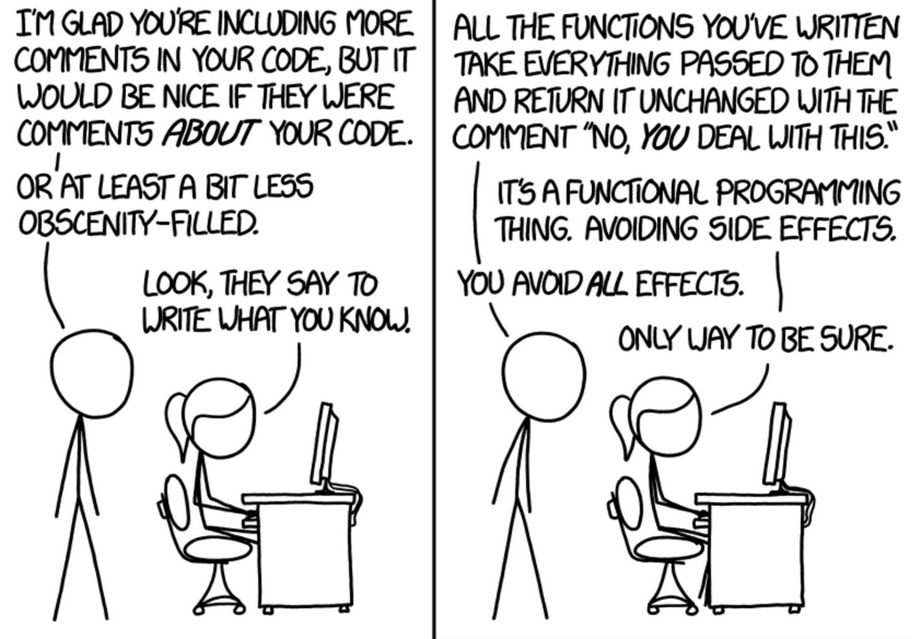

# Input and Output

Comic by [xkcd](https://xkcd.com/1790/).

The term "i/o" stands for input/output. In the context of writing programs, i/o refers to anything in our code that interacts with the "outside world." And "outside world" just means anything that's not stored in our application's memory (like variables).

## Examples of I/O
- Reading from or writing to a file on the hard drive
- Accessing the internet
- Reading from or writing to a database
- Even simply printing to the console!!

All i/o is a form of "side effect."

## Assignment
In Doc2Doc, we frequently need to change the casing of some text. For example:

### TitleCase
> Every Day Once A Day Give Yourself A Present

### LowerCase
> every day once a day give yourself a present

### UpperCase
> EVERY DAY ONCE A DAY GIVE YOURSELF A PRESENT

There's an issue in the `convert_case` function; our test suite can't test its behavior because it's printing to the console (eww, a side effect) instead of returning a value. Fix the function so that it returns the correct value instead of printing it.