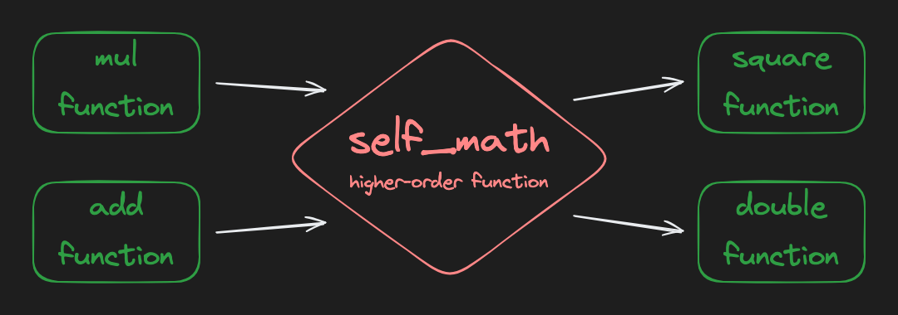

# Function Transformations
"Function transformation" is just a concise way to describe a specific type of [higher-order function](https://en.wikipedia.org/wiki/Higher-order_function). It's when a function takes a function (or functions) as input and returns a new function. Let's look at an example:


```python
from collections.abc import Callable

def multiply(x: int, y: int) -> int:
    return x * y

def add(x: int, y: int) -> int:
    return x + y

# self_math is a higher-order function
# input: a function that takes two arguments and returns a value
# output: a new function that takes one argument and returns a value
def self_math(math_func: Callable[[int, int], int]) -> Callable[[int], int]:
    def inner_func(x: int) -> int:
        return math_func(x, x)
    return inner_func

square_func: Callable[[int], int] = self_math(multiply)
double_func: Callable[[int], int] = self_math(add)

print(square_func(5))
# prints 25

print(double_func(5))
# prints 10
```

The `self_math` function takes a function that operates on two different parameters (e.g. `multiply` or `add`) and returns a new function that operates on one parameter twice (e.g. `square` or `double`).
<br />
<br />

## Assignment
oc2Doc needs a good logging system so that users and developers alike can see what's going on under the hood. Complete the **`get_logger`** function.

It takes a `formatter` function as a parameter and returns a new function. Steps:
1. Define a new function, `logger`, inside `get_logger` (see `self_math` above as an example). It accepts two strings. You can just name them `first` and `second` if you like.
2. The `logger` function should not return anything. It should simply `print` the result of calling the given `formatter` function with the `first` and `second` strings as arguments.
3. Return the new `logger` function.

## Tip
The `colon_delimit` and `dash_delimit` functions are "formatters" that will be passed into our `get_logger` function by the tests. You don't need to touch them, but it's important to understand that when you call `formatter()` in the `get_logger` function, you're calling one of these functions.